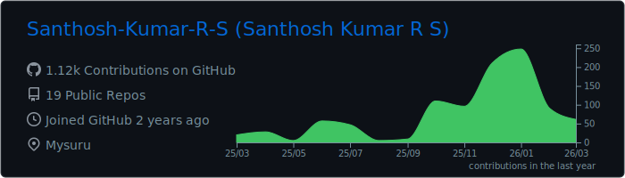
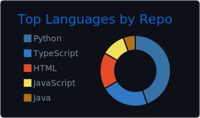
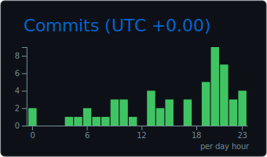

<div align="center">

# Hi there, I'm Santhosh Kumar R S 👋


<p align="center">
  
  <a href="https://github.com/Santhosh-Kumar-R-S?tab=followers">
    
  </a>
</p>

</div>

---

## 🚀 About Me

```javascript
const santhosh = {
    location: "Mysuru, Karnataka, India",
    education: "Srinivas University, Mangaluru",
    currentFocus: ["Web Development", "Data Analysis", "Cloud Computing"],
    interests: ["Full Stack Development", "Machine Learning", "UI/UX Design"],
    askMeAbout: ["Web Dev", "Python", "Data Visualization", "Cloud Solutions"],
    funFact: "I debug with console.log() and I'm not ashamed! 😄"
};
```

- 🌍 Based in **Mysuru, Karnataka, India**
- 🎓 Student at **Srinivas University, Mangaluru**
- 💼 **Web Developer** & **Data Analyst**
- 🌐 Portfolio: [santhoshkumarrs.netlify.app](https://santhoshkumarrs.netlify.app)
- 📧 Reach me at: **[snthshkumarrs@gmail.com](mailto:snthshkumarrs@gmail.com)**
- 🤝 Open to collaborating on **interesting projects**
- ⚡ Always learning, always growing

---

## 🛠️ Tech Stack

### Languages
<p align="left">
  
  
  
  
</p>

### Frontend
<p align="left">
  
  
  
</p>

### Database & Cloud
<p align="left">
  
  
  
</p>

### Tools & Technologies
<p align="left">
  
  
  
</p>

---


## 📊 GitHub Statistics

<div align="center">






</div>

---

## 🌐 Connect With Me

<div align="center">
  <a href="https://github.com/Santhosh-Kumar-R-S">
    
  </a>
  <a href="https://www.linkedin.com/in/santhosh-kumar-r-s">
    
  </a>
  <a href="https://www.instagram.com/santhosh_kumar_r_s">
    
  </a>
  <a href="https://www.x.com/Santhosh_1817">
    
  </a>
  <a href="mailto:snthshkumarrs@gmail.com">
    
  </a>
  <a href="https://santhoshkumarrs.netlify.app">
    
  </a>
</div>

---

<div align="center">
  
### 💭 Quote of the Day
  


### ✨ Show some ❤️ by starring some repositories!


---

**Made with ❤️ by Santhosh Kumar R S**


</div>
